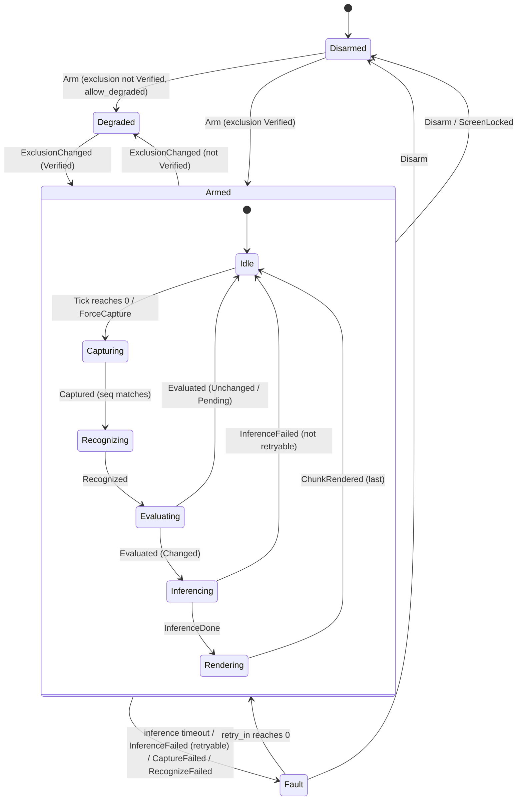

# butler-ai architecture

The system in one page, with the decisions that shaped it. The specs under
`specs/` are normative; this document is the map. Where they disagree, the
spec wins and this document is wrong.

## 1. What it is

A desktop overlay that reads the user's screen and answers what it sees,
without appearing in anyone else's recording of that screen.

```
             ┌──────────────────────────── the user's display ────────────────────────────┐
             │  other apps (a call, a document, a browser)          ┌───────────────────┐ │
             │                                                      │ Butler overlay    │ │
             │                                                      │ (transparent,     │ │
             │                                                      │  click-through,   │ │
             │                                                      │  capture-excluded)│ │
             │                                                      └───────────────────┘ │
             └───────────────────────────────────────────────────────────────────────────┘
                     │ compositor capture (excludes the overlay)                ▲
                     ▼                                                          │ paced chunks
   ScreenSource ──▶ Frame ──▶ TextRecognizer ──▶ Recognized ──▶ normalize ──▶ ChangeDetector
   (006, xcap)      (RGBA,      (007, Vision /     (lines +       (007)          (008, Levenshtein
                    zeroized)    Windows OCR)      text)                          ratio + stability)
                                                                                      │ Changed
                                                                                      ▼
                                          redact (015) ──▶ InferenceRequest ──▶ Assistant (010, Claude SSE)
                                                                                      │ Chunk::Text
                                                                                      ▼
                                                                          Pacer (013) ──▶ UiEvent::AnswerChunk (011) ──▶ overlay (012)
```

All of the arrows are effects executed by a runtime on behalf of one pure state
machine (009), executed by the runtime host in the desktop crate (019). The
machine decides *when*; the crates decide *how*.

## 2. Crate map and ownership

| Package | Path | Owns | Spec |
|---|---|---|---|
| `butler-core` | `crates/butler-core` | `machine` (reducer), `delta`, `pacing`, `settings`, `redaction`, `ipc` types. No OS, clock, fs, net, `tokio`, `tauri`. | 009 (crate), 008, 013, 014, 015, 011 |
| `butler-capture` | `crates/butler-capture` | `ScreenSource` trait, `XcapSource`, `Frame`, monitors | 006 |
| `butler-ocr` | `crates/butler-ocr` | `TextRecognizer` trait, Apple Vision, Windows OCR, `normalize` | 007 |
| `butler-llm` | `crates/butler-llm` | `Assistant` trait, Claude Messages API client, SSE, prompt, keychain `SecretStore`, `SpendGuard` | 010 |
| `butler-desktop` | `apps/desktop/src-tauri` | Tauri app: window, exclusion + self-test, shortcuts, tray, permissions, runtime, commands/events, settings store, logging, diagnostics | 004 (crate), 005, 009, 011, 014, 016 |
| `@butler-ai/desktop` | `apps/desktop` | SolidJS overlay, generated IPC bindings, paced answer, panels | 012 (package), 011, 013, 014 |

A crate boundary is an ownership boundary. A spec that adds a file inside
another spec's crate does so with an `extends { spec, unit }` edge, so the
indexer shows both owners and the gate requires the right spec to move with
the code.

## 3. The state machine (spec 009)



Guarantees the reducer gives by construction: a `Captured`/`Recognized`/
`Evaluated` whose `seq` is not the current one is dropped (out-of-order
guard); nothing during `Inferencing` can start a second inference (single
in-flight, no queue); `Disarm` from any state releases every frame and
cancels any inference; every `(state, event)` pair is total.

The transition table in `crates/butler-core/tests/machine.rs` is the source of
truth for this diagram; once the crate exists a test regenerates this section.

## 4. Data flow and the privacy boundary (spec 015)

| Class | Type | Memory | Disk | Network | Logs |
|---|---|---|---|---|---|
| Pixels | `Frame` | until released, then zeroed | never | never | never |
| Recognized text | `Recognized` | until next commit / disarm | never | never as-is | never |
| Redacted text | `RedactedText` | inside one request | never | configured provider only | never |
| Answer | `String` | until dismiss / disarm | never | only as `prior_answer` to the same provider | never |
| Secret | `Secret` | during header construction | OS keychain only | provider header only | never |
| Settings | `Settings` | always | config dir, `0600` | never | field names only |

The types enforce most of this (`!Serialize`, private fields, single
constructors, zeroize on drop); tests named in the specs enforce the rest.

## 5. Capture exclusion is verified, not assumed (spec 005)

Windows: `SetWindowDisplayAffinity(hwnd, WDA_EXCLUDEFROMCAPTURE)`. macOS:
`NSWindow.sharingType = .none`. Both are requests to the compositor. On
every arm, the app renders a sentinel pattern in the overlay, captures the
monitor through the same compositor path recording tools use, and asserts the
sentinel is absent. The result (`Verified`, `Compromised`, `Unsupported`) is
shown in the overlay and gates arming; degraded mode is opt-in and carries an
unmistakable banner. The same verification is what keeps the pipeline from
reading its own answers back.

## 6. Decision log

| # | Decision | Alternatives | Why |
|---|---|---|---|
| D1 | Tauri v2 (Rust process + system webview) | Electron; native Swift/WinUI apps | Native window handles for exclusion; one codebase for two platforms; small binary; typed IPC via `tauri-specta`. |
| D2 | SolidJS for the overlay | React | The overlay is a passive mirror of one external store fed by one event stream; Solid's `createStore` + `reconcile` is that primitive, with per-field subscription and no memoization discipline. Synchronous DOM commits keep the exclusion self-test's "is the sentinel painted" question one step (React 18 batches and may defer the commit). No dependency arrays or effect re-runs, the React defect class that typechecks and ships; the Solid-specific class (destructured props, conditional returns, untracked signal reads) is caught by `eslint-plugin-solid` (012 §3.1). Token-rate streaming is not the reason (pacing is in core, D7); bundle size is not either (assets load from disk). |
| D3 | Pure reducer (009) + effect runtime host (019) | Async tasks with shared state; an actor per stage | Exhaustively testable transition table; the outline's ordering guarantees become properties, not hopes. |
| D4 | OS-native OCR (Vision, Windows.Media.Ocr) | Tesseract; PaddleOCR / RapidOCR via ONNX | No bundled model, no GPU dependency of our own, hardware-accelerated, on-device by definition. |
| D5 | Snapshot polling (2.5 s default) | Continuous SCStream / DXGI stream | Text changes on the order of seconds; polling is an order of magnitude cheaper in CPU and battery. |
| D6 | Compare against the last *inferred* text with a stability window (008) | Compare consecutive frames | Slow drift still accumulates into a change; mid-scroll frames never fire. |
| D7 | Pacing in Rust core, UI as passive renderer (013) | Pace in the UI | The machine knows when rendering is complete; the policy is testable without a browser. |
| D8 | Claude Messages API over raw HTTPS + SSE (010) | A community Rust SDK | No official Rust SDK; the wire contract is small and pinned by fixture tests; provider is a trait. |
| D9 | Secrets in the OS keychain (010) | Settings file; env vars | Never on disk in plaintext; no env surface at all. |
| D10 | Specify first, ratchet on from day one (000) | Adopt governance after a prototype | Greenfield: zero debt to burn down; every file is claimed before it exists. |
| D11 | Linux deferred (001) | Ship without exclusion on Linux | No compositor-level exclusion under X11; the product promise would be false there. |
| D12 | One overlay window (004) | Separate settings/onboarding windows | A second window needs its own exclusion and self-test; panels inside the overlay do not. |

Add a row when a spec is amended for a design reason (spec 018 R-006).

## 7. Reference hardware (for the performance FRs)

To be fixed in phase 3: one Apple Silicon laptop (M-series, 16 GB) and one
Windows laptop (recent x86-64, integrated GPU, 16 GB), named here by model
when chosen. Performance numbers in specs 006, 007, 008 are measured on them.

## 8. Settings defaults (spec 014)

Generated from `Settings::default()` by a test once the crate exists; until
then the values in spec 014 §3.1 are the reference.
